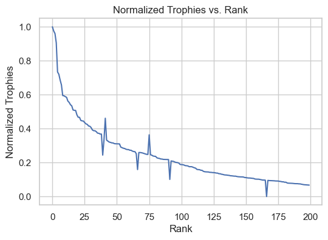
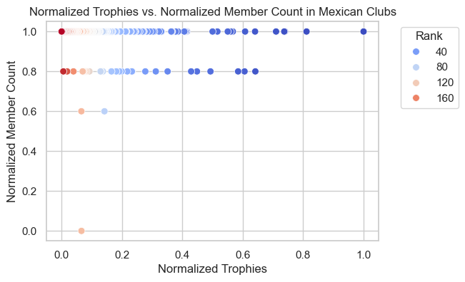
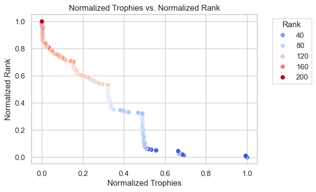

# Data Visualization Techniques for Brawl Stars Dataset Analysis: Data Exploration and Visualization

This project explores and visualizes Brawl Stars data through a set of visual analysis techniques. The generated graphs help to understand patterns, trends, and key relationships in player and club performance, providing valuable insights for data analysis in gaming. This is the simple report of the project, to check the detailed report of the project you could go to the directory `reports/` and check it there, or [click here](https://github.com/pyrawn/Data-Visualization-Techniques-for-Brawl-Stars-Dataset-Analysis-Data-Exploration-And-Visualization/blob/80f1101c7deddf2670981c6c7590f8af18beb285/reports/Technical-Report.pdf))

---

## Table of Contents
- [Introduction](#introduction)
- [Project Structure](#project-structure)
- [Exploratory Data Analysis](#exploratory-data-analysis)
- [Visualizations](#visualizations)
- [Conclusions](#conclusions)
- [Authors](#authors)

---

### Introduction

This data analysis and visualization project focuses on the Brawl Stars dataset, collected both globally and nationally for the top 200 players and clubs. It includes variables such as trophies, rankings, and brawler statistics, offering an in-depth perspective on performance metrics in the game.

### Project Structure

The project is structured as follows:

- `data/`: Contains both the original and preprocessed datasets.
- `notebooks/`: Jupyter notebooks for exploratory analysis and visualization.
- `reports/`: Generated graphs from the analysis and the concrete report in PDF.
- `src/`: Python scripts for data preprocessing and visualization.
- `README.md`: Project documentation.

### Exploratory Data Analysis

Data cleaning and preprocessing were performed, followed by exploratory analysis. Key analyzed variables include:
- **Trophies**: General distribution and by region.
- **Ranks**: Comparative analysis between players and clubs.
- **Character roles**: Analysis of most-used characters and role distribution.
- **Club membership**: Member count and ranking analysis.

### Visualizations

Key visualizations are presented below:

### Conclusions

The generated visualizations reveal significant patterns in player performance and behavior, helping to identify predominant roles, trophy distributions, and strategies used by top clubs. This analysis could be valuable for optimizing game strategies and enhancing game features.

### Colaborators

- **Lorena Danae Perez Lopez**
- **Julio Cesar De Aquino Castellanos**
